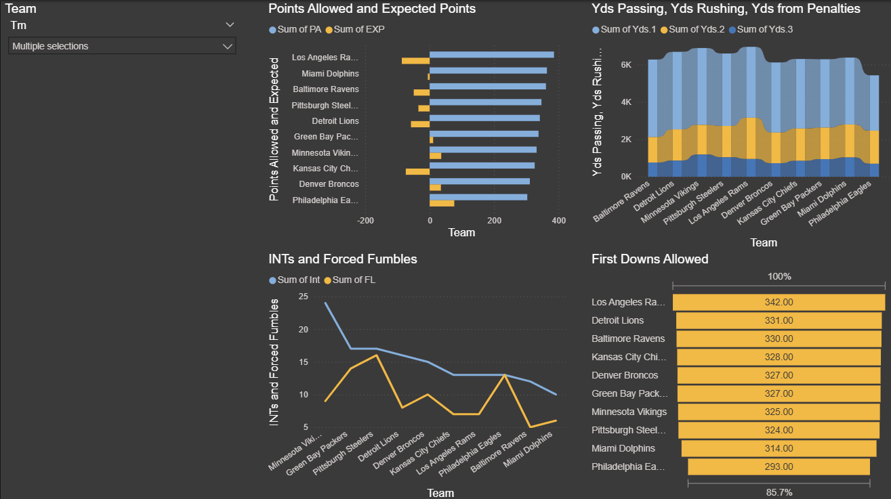
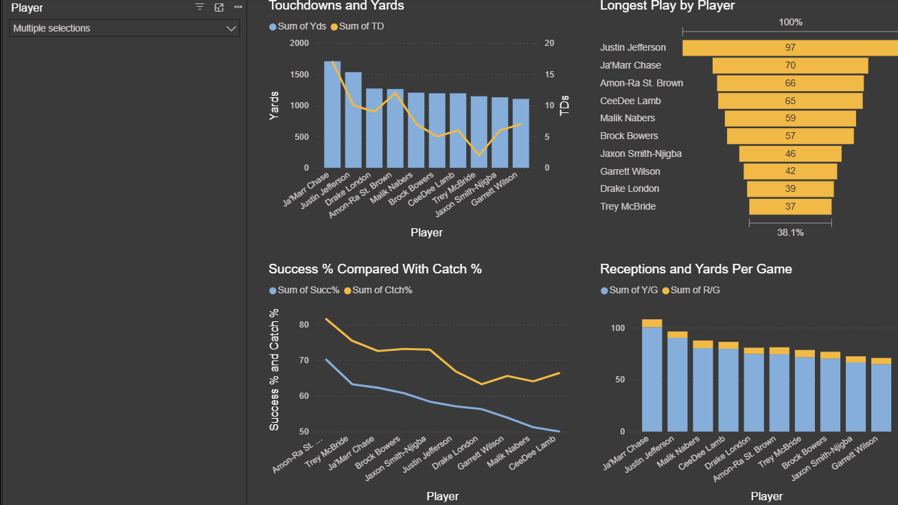

# nfl_powerBI

## Goal/Explanation:
This project uses data from Pro-Football-Reference
 to build Power BI dashboards for analyzing and comparing NFL players and teams.

The goal is to support fantasy football drafting and trade decisions by providing visual insights into player and team performance across multiple statistical categories.

## Data Collection

* Source: Pro-Football-Reference
* Seasons: Current and previous NFL seasons
* Data Scraped:
   * Player statistics: Passing, Rushing, Receiving, Defensive
   * Team statistics: Offensive & Defensive
    
Data was collected using Python web scraping scripts and connected to Power BI for visualization

## Example Dashboards
Each dataset has a dedicated Power BI dashboard.
Users can use a selector (slicer) to filter one or more players/teams (works best with multiple selections).

### Player Receiving Dashboard

### Team Defensive Dashboard

## Needed Tech
* Python
  * Pandas
  * selenium
  * BeautifulSoup
  * datetime
* Power BI

## Next Steps
Automate weekly data refresh during NFL season.

Build predictive models for fantasy projections.
